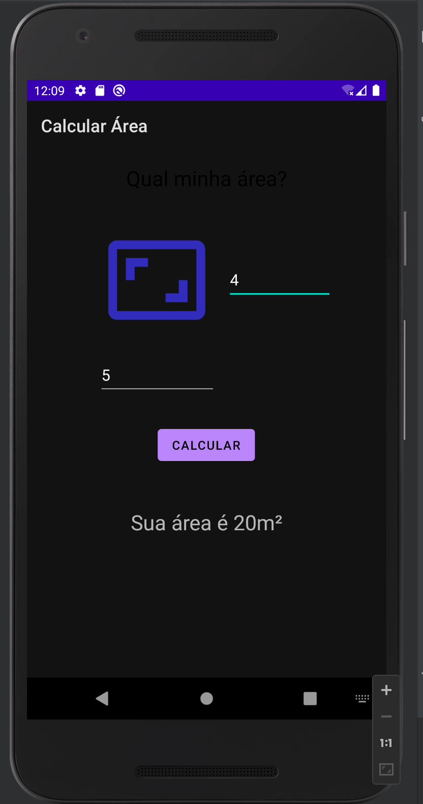

# Calculadora de Área
versionCode: "1" 
versionName: "1.0.1"

# Introdução
Este aplicativo foi desenvolvido para fins academicos na aula de Desenvolvimento Android com Kotlin  
Nosso aplicativo tem como objetivo receber os valores de altura e largura e dar o resultado da área em metros quadrados

